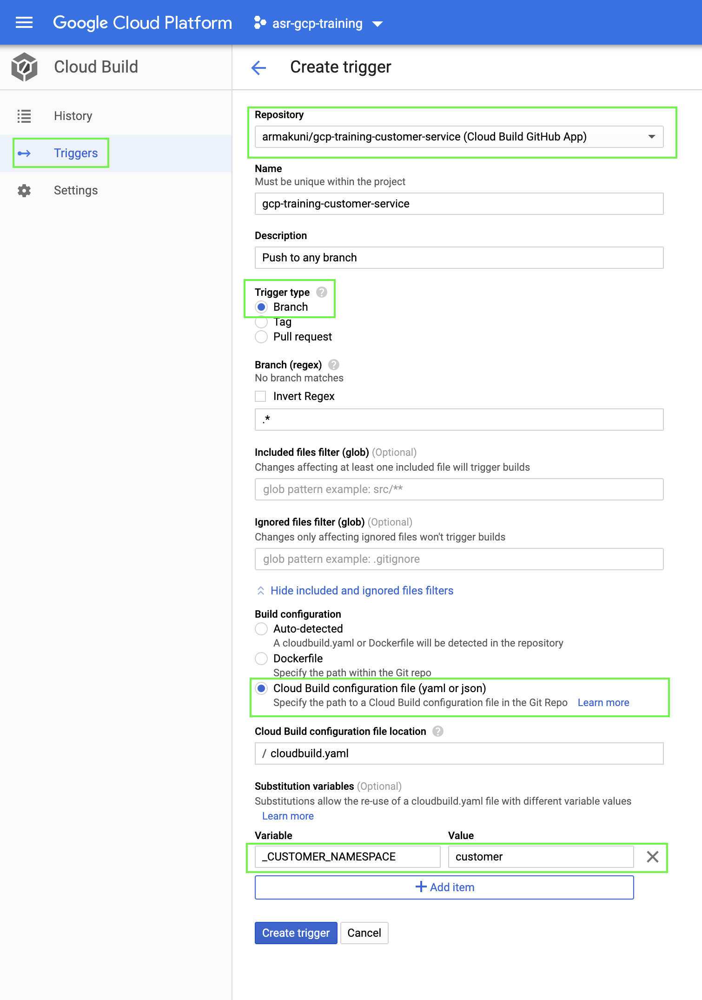

# GCP Training Customer Service

This Microservice is a RESTful API which can store and retrieve customer information using a Firestore database. The following two endpoints are available:
1. POST - http://localhost:5000/customers/ to create a customer and accept below request body:
 ```json
 {
"firstName" : "Roger",
"surname" : "Federer"
}
 ```
 Response:
  ```json
  {
    "customerId": "obrJrtC8bFSXdAmpcmKe",
    "firstName": "Roger",
    "surname": "Federer"
}
 ```
 2. GET - http://localhost:5000/customers/{CUSTOMER_ID}  
   Response:
   ```json
   {
    "customerId": "obrJrtC8bFSXdAmpcmKe",
    "firstName": "Roger",
    "surname": "RajFedererput"
}
 ```

Fork this repository in your github account to continue the rest of exercise.

### Requirements

- A Firestore instance up and running in your Google Cloud account
- google service account to access the Firestore

#### Refer below link for more detail about setting up the environment to use google Firestore

- https://cloud.google.com/firestore/docs/quickstart-servers

### Environment variables

The service uses the below variables in its configuration. They all have default values as shown below if they are not otherwise specified:

```
CUSTOMER_NAMESPACE=customers(default)
PORT=5000(default)
```

### To run linter

```bash
make lint
```

### To run tests

```bash
make test
```

### To run the service locally
Before starting the application locally you must create Google Service Account and store credentials json file locally to authenticate.

Once you have stored the credentials locally, export it to the environment variable as below:
```bash
export GOOGLE_APPLICATION_CREDENTIALS=[PATH_TO_CREDENTIALS_FILE]/[SERVICE_ACCOUNT_CREDENTIALS_FILENAME].json 
```

```bash
make run
```

### Deployment

#### CLI Deployment

This repository contains a cloudbuild.yaml file to deploy this service on to Cloud Run:

Execute below command to trigger the Cloud Build deployment through CLI.
```bash
gcloud builds submit --substitutions=_CUSTOMER_NAMESPACE="[CUSTOMER_NAMESPACE]"
```

where [CUSTOMER_NAMESPACE] is the name of the Firestore collection that stores the customer information.
* Makes sure that variable name matches with what is been defined in the "cloudbuild.yaml". If you wish to change the variable name then you must replace all the respective references in the [cloudbuild.yaml](/cloudbuild.yaml) as well.
* Make a note of the value specified as we will need it while deploying other Microservices.
* If you do not specify the substitution parameters (to know more about substitutions [click here](https://cloud.google.com/cloud-build/docs/configuring-builds/substitute-variable-values)) the clouldbuild will use default value specified in the CloudBuild.yaml i.e., "customer".


#### Setup Cloud Build Trigger to deploy Microservice on each commit

Now let us setup a Cloud Build Trigger to deploy the changes automatically with each commit.

1. Navigate to the Cloud Build page in console and click ```Triggers```
2. Click ```Create Trigger``` and should open a new page.
3. Enter all the information highlighted in below image.
4. Set the substitutions variables appropriately. As explained earlier if you wish you change the variable name you must change in the "cloudbuild.yaml" as well.
5. The value specified here will override any default value defined in the "cloudbuild.yaml". If you wish to change the value make a note of it.

6. Click Create Trigger and your trigger should be ready to use.
7. Make a commit and observe Cloud Build to confirm the trigger is working fine.

### API documentation

You can access the API documentation by launching the application and visiting [swagger ui](http://localhost:5000/docs/).
For accessing in Cloud Run append ```/docs/``` after the endpoint exposed by Cloud Run service.
